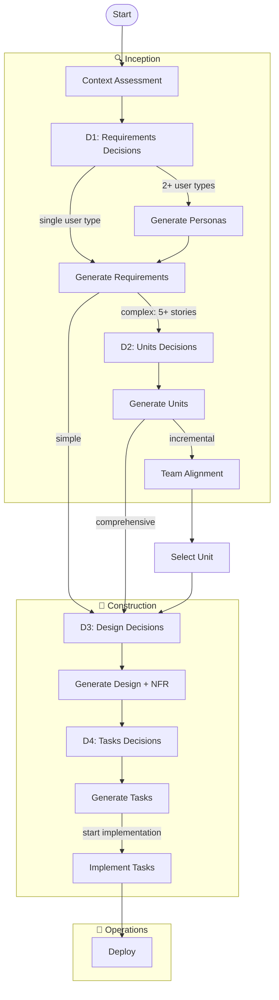

# AI-DLC Spec Workflow — Agent-Based Architecture

A decision-driven software specification workflow powered by persona-based agents. Each phase is handled by a specialist agent (Business Analyst, Product Owner, Solution Architect, Software Architect, Tech Lead, Software Engineer) coordinated by a Project Manager orchestrator.

**Version**: 4.0.0

**Supported Tools**: Kiro IDE and Kiro CLI. Claude Code and other tools (Cursor, Windsurf) support is work in progress.

## Quick Start

```
Use the aidlc skill to create a spec for [feature description]
```

Or in Kiro CLI, swap to the orchestrator agent directly:
```
/agent swap aidlc-orchestrator
```

The workflow detects your language and communicates in it throughout. Technical content (code, paths, identifiers) stays universal.

## How It Works

The orchestrator manages the full workflow. For each phase it:
1. Invokes a specialist agent via `invokeSubAgent` with structured inputs
2. Presents the agent's output to the user
3. Waits for approval
4. Updates workflow state and audit trail
5. Routes to the next phase

At each phase, you make explicit decisions through decision gates:
- **D1 Requirements Decisions**: Feature scope, user types, core functionality
- **D2 Units Decisions**: Decomposition strategy, architecture pattern
- **D3 Design Decisions**: Technology stack, frontend hosting, IaC, testing, NFRs
- **D4 Tasks Decisions**: Implementation approach, task breakdown, testing strategy

Simple features (≤4 stories) skip Phase 3. Simple designs (≤10 stories) get a single `design.md` instead of a modular folder.

## Workflow Overview



## Agents

All phases are delegated to specialist agents via `invokeSubAgent`. The orchestrator handles user interaction between invocations.

| Agent | Persona | Phase | Responsibility |
|-------|---------|-------|---------------|
| Orchestrator | Project Manager | All | Routes work, manages state, handles user interaction |
| Business Analyst (BA) | Discovery Lead | 1. Context | Scans workspace, assesses impact, generates context.md |
| Product Owner (PO) | Product Manager | 2. Requirements | D1 Requirements Decisions, personas, user stories with EARS criteria |
| Solution Architect (SA) | Lead Architect | 3. Units | D2 Units Decisions, system decomposition, team alignment |
| Software Architect | Technical Architect | 4. Design | D3 Design Decisions, components, data model, APIs, NFR |
| Tech Lead (TL) | Engineering Manager | 5. Tasks | D4 Tasks Decisions, task breakdown, implementation plan |
| Software Engineer (SE) | Senior Developer | 6. Implementation | Code, tests, coverage tracking, merge resolution |
| Architecture Reviewer | Review Board | Cross-cutting | Reviews designs across workstreams for conflicts |

### Agent Actions

| Agent | Action | Description |
|-------|--------|-------------|
| Business Analyst | `context-assessment` | Scan workspace, generate context.md and steering files |
| Product Owner | `requirements-decisions` | Generate D1 Requirements Decisions gate |
| Product Owner | `requirements-generation` | Generate personas.md (if needed) and requirements.md |
| Solution Architect | `unit-decisions` | Generate D2 Units Decisions gate |
| Solution Architect | `unit-generation` | Generate units.md |
| Solution Architect | `team-alignment` | Generate team-alignment.md (incremental mode) |
| Software Architect | `design-decisions` | Generate D3 Design Decisions gate |
| Software Architect | `design-generation` | Generate design.md and design/* files |
| Tech Lead | `tasks-decisions` | Generate D4 Tasks Decisions gate |
| Tech Lead | `tasks-generation` | Generate tasks.md |
| Software Engineer | `implement` | Implement a single task following design specs |
| Software Engineer | `resolve-conflict` | Resolve merge conflicts between workstreams |
| Architecture Reviewer | `review-designs` | Review designs across units for conflicts |

## Installation

Copy 3 folders to your Kiro project's `.kiro/` directory:

```bash
cp -r agents/     /path/to/project/.kiro/agents/       # Agent configs and prompt loaders
cp -r references/ /path/to/project/.kiro/references/    # Agent prompts, templates, guides, shared rules
cp -r skills/     /path/to/project/.kiro/skills/        # SKILL.md entry point
```

Agent configs are provided in two formats:
- `.json` — Kiro format (config + `file://` prompt reference)
- `.md` — YAML frontmatter format (for future Claude Code support)

## Usage

### Kiro IDE

Activate the skill in chat:
```
Use the aidlc skill to create a spec for [feature]
```

### Kiro CLI

Two options:

**Option 1 — Via skill**:
```
Use the aidlc skill to create a spec for [feature]
```

**Option 2 — Via agent swap**:
```
/agent swap aidlc-orchestrator
```
Then tell the orchestrator what to build. This directly loads the orchestrator agent which manages the full workflow.

### Resume an Existing Spec
```
Continue my [feature] spec
```

## Team Alignment (Incremental Mode)

When units are defined and incremental mode is chosen, a Team Alignment step asks about:
- Team structure (solo / small team / multiple teams)
- Repository strategy (monorepo / multi-repo / hybrid)
- Shared foundations (conventions, API contracts)
- API architecture (gateway / BFF / direct — for microservices)

Solo developers can skip this step.

## Steering Files

Phase 1 generates persistent project context files at `.kiro/steering/`:
- `product.md` — product overview, target users, key features
- `tech.md` — technology stack, architecture, conventions
- `structure.md` — repository layout, key directories, entry points
- `aidlc-workflow.md` — workflow instructions and implementation context

These are progressively enriched: Phase 2 updates `product.md`, Phase 4 updates `tech.md` and `structure.md`. The `aidlc-workflow.md` file ensures the workflow is followed across sessions and provides implementation context when executing tasks directly.

## Generated Artifacts

**Spec artifacts** (`.kiro/specs/{feature}/`):
- `context.md`, `personas.md`, `requirements.md`, `units.md`
- `team-alignment.md` (incremental mode only)
- `design.md` + optional `design/` folder
- `tasks.md`

**Workflow state** (`.aidlc/workflow/{feature}/`):
- `decisions-*.md`, `audit.md`, `.workflow-state.json`

In incremental mode, each unit gets its own folders:
- Specs: `.kiro/specs/{feature}-{unit}/`
- Workflow: `.aidlc/workflow/{feature}-{unit}/`

## Project Structure

```
├── agents/                               # Agent configs (JSON + MD formats)
│   ├── orchestrator.json / .md
│   ├── business-analyst.json / .md
│   ├── product-owner.json / .md
│   ├── solution-architect.json / .md
│   ├── software-architect.json / .md
│   ├── tech-lead.json / .md
│   ├── software-engineer.json / .md
│   └── architecture-reviewer.json / .md
├── references/
│   └── aidlc/
│       ├── agent-prompts/                # Full agent prompt files (8 files)
│       ├── templates/                    # Output templates (21 files)
│       ├── guides/                       # Reference guides (12 files)
│       └── shared/                       # Workflow rules, state, validation (6 files)
├── skills/
│   └── aidlc/
│       └── SKILL.md                      # Entry point — loads orchestrator
└── README.md
```

## Workflow Variations

**Simple** (≤4 stories, single domain):
```
Orchestrator → BA → PO (D1 Requirements Decisions → Requirements) → Software Architect (D3 Design Decisions → Design) → TL (D4 Tasks Decisions → Tasks) → [SE]
```

**Complex** (5+ stories, multiple domains):
```
Orchestrator → BA → PO (D1 Requirements Decisions → Personas → Requirements) → SA (D2 Units Decisions → Units → Team Alignment) → Software Architect (D3 Design Decisions → Design + NFR) → TL (D4 Tasks Decisions → Tasks) → [SE]
```

**Incremental** (per unit, after units defined):
```
→ SA (Team Alignment) → for EACH unit: Software Architect (D3 Design Decisions → Design) → TL (D4 Tasks Decisions → Tasks) → [SE] → next unit
```

## Key Features

- **Agent-based architecture** — Each phase handled by a specialist with a real-world persona
- **Context efficiency** — Phase agents only load what they need
- **Multi-language support** — Detects your language, generates everything in it
- **Decision-driven** — You make the choices, agents generate from your decisions
- **Adaptive complexity** — Simple features get lightweight output, complex systems get full modular specs
- **Team alignment** — Shared conventions and integration contracts for multi-team incremental development
- **Resume across sessions** — Pick up where you left off, even after context compaction
- **Complete traceability** — Every artifact references its source decisions

## Credits

- [AI-DLC Methodology](https://github.com/awslabs/aidlc-workflows)
- [Agent Skills Standard](https://github.com/modelcontextprotocol/agent-skills)
- [EARS Notation](https://www.iaria.org/conferences2015/filesICCGI15/ICCGI_2015_Tutorial_EARS.pdf)

## License

MIT
